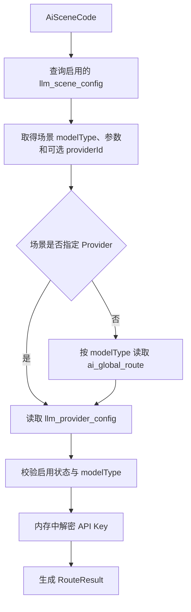

# InterviewGuide 项目记忆

> 快照日期：2026-07-30
>
> 用途：将本文件提供给其他 AI 智能体或网页端 ChatGPT，使其在开始工作前获得统一的项目背景。
>
> 当前 Git 分支：`resumes`；基线提交：`08a20a7`。工作区存在尚未提交的阶段二 AI 开发改动，因此执行任务前必须重新读取 `git status` 和目标文件。

## 1. 使用规则与事实来源

本文件是项目上下文摘要，不替代代码和专项设计文档。新的 AI 接手任务时应遵循：

1. 先读取 `AGENTS.md`，它是仓库内的开发规范。
2. 只读取本次任务涉及的代码和文档，不因本文件而擅自扩展范围。
3. “规划目标”以 `../功能.md`、`../执行计划.md` 和阶段文档为依据；“架构决策”以 `../设计决策记录.md` 为依据；“当前实现”必须以代码、测试和 SQL 为准。
4. 文档与代码冲突时，不要静默选择一方。先指出差异，再根据用户要求修复。
5. 不在对话、日志、测试或本文档中传播数据库密码、API Key、个人简历等敏感信息。

已知文档漂移：

- `执行计划.md` 的部分完成度和旧接口名称落后于当前代码，例如 LLM 配置模块已经落地，但简历 AI 执行链路仍未闭环。
- `第2阶段/PHASE2_AI_BUILD_CHECKLIST.md` 是早期方案，其中的包结构、Topic 名称和完成状态不再完全准确。
- 根目录 `databases.md` 与 `docs/databases.md` 是两份需要同步维护的数据库文档。
- `第9阶段/` 与 `第九阶段/` 存在重叠文档，修改前应先确认目标文件。

## 2. 项目定位

InterviewGuide 是一个面向未来微服务拆分的模块化单体项目，目标是构建“智能 SaaS 招聘与多模态面试平台”。

核心业务域：

- B 端招聘：企业租户、团队、岗位、候选人、简历解析、人岗匹配、面试模板、排期、接管和报告。
- C 端求职：岗位发现与投递、文本/语音/代码面试、面试报告和 AI 辅导。
- 平台管理：RBAC、风控、LLM Provider 与路由、套餐、钱包、订单和 Token 成本。
- 数据智能：知识库、RAG、向量检索、日志归档和 Spark 离线语料处理。

优先级划分：

- P0：阶段 1～4，形成企业入驻、岗位、投递、文本面试和计费闭环。
- P1：阶段 5～9，逐步增加语音、代码沙箱、RAG、合规和运营能力。

## 3. 技术栈与运行依赖

- Java 21、Spring Boot 4.0.1、Maven Reactor。
- Spring AI 2.0.0-M4；当前真实客户端实现面向 OpenAI Compatible Chat API。
- MyBatis-Plus、Mapper XML、MapStruct、Lombok。
- PostgreSQL；使用 JSONB、TIMESTAMPTZ、逻辑删除、部分索引、唯一索引和 Advisory Lock。
- Redis：JWT 黑名单、短信验证码、Challenge 和一次性安全令牌。
- Caffeine：LLM Provider、场景、全局路由和路由结果缓存。
- RustFS/S3 兼容对象存储；Apache Tika 负责简历文本提取。
- JUnit Jupiter、Mockito、Spring Test、Testcontainers PostgreSQL 2.0.5。

应用入口在 `bootstrap`，默认端口为 `8080`。本地启动还需要 PostgreSQL、Redis 和 RustFS；机器密钥应通过环境变量或本地配置提供，不得提交到仓库。当前 PostgreSQL 14 环境未启用 pgvector，阶段 7 开始前需要更换或扩展数据库镜像。

## 4. 仓库与模块边界

开发命令从 `interview-guide/` 执行。

| 模块 | 职责 |
|---|---|
| `bootstrap` | Spring Boot 启动、运行时配置、聚合各业务模块 |
| `common` | 共享枚举、常量、注解、异常、安全上下文、消息 SPI |
| `api` | 跨模块接口及 DTO；未来远程调用边界 |
| `framework` | JWT、权限、风控、安全令牌、MyBatis 和 Web 配置 |
| `modules/system` | 认证、Token、短信、Challenge、用户、企业、团队、RBAC |
| `modules/infra` | 文件哈希/解析/存储、本地消息表、租约调度和 Transport |
| `modules/bportal` | 岗位、简历、投递、人岗匹配、面试模板与排期 |
| `modules/cportal` | 候选人面试、文本面试、语音面试、未来沙箱和导师 |
| `modules/aicore` | LLM Provider、全局路由、场景配置、模型客户端和 AI 能力 |
| `modules/admin` | SKU、钱包、订单、支付和 Token 消耗查询 |
| `modules/engine` | 预留知识库、检索和归档能力，目前无 Java 实现 |
| `modules/Spark` | 预留离线语料流水线，目前无 Java 实现 |

模块数据所有权是硬约束：

- 模块只能直接访问自己拥有的表和 Mapper。
- 跨模块调用必须通过 `api` 中的接口或领域消息，禁止引用对方 Mapper。
- 不建立跨模块数据库物理外键，只保留“逻辑外键”字段。
- 当前 `bportal/cportal/admin` 的 POM 仍直接依赖 `aicore`，而 `api/aicore` 尚无正式契约；接入简历 AI 前应先补齐 API 边界，避免把当前单体依赖固化为未来微服务耦合。
- Outbox 在模块化单体中可以由本地实现加入调用方事务；拆库后必须部署在业务服务自己的数据库，不能远程调用中央消息服务写“本地事务消息”。

## 5. 关键架构决策

### 5.1 认证、授权与风控

- 采用 Access Token + Refresh Token。Access Token 是短时 JWT；Refresh Token 的哈希保存在 `user_tokens`。
- Refresh Token 每次刷新都轮换；已撤销 Token 再次出现视为重放，触发该用户 Token 全量撤销。
- 登录 JWT 默认不携带 `enterpriseId`；管理前端通过 `/auth/workspace` 选择企业或平台工作区，切换后旧 JWT 进入 Redis 黑名单并签发新 JWT。
- RBAC 分 PLATFORM、ENTERPRISE、BOTH 三种作用域。`@RequirePermission` 才是业务权限边界。
- `@MaxRiskLevel` 只限制被系统标记的风险用户，不能替代租户归属或权限检查。

### 5.2 敏感操作 Challenge

普通注册、登录、重置密码使用普通短信验证码。敏感操作使用服务端创建的 Challenge：

```text
业务服务确定 userId + enterpriseId + action + phone
    → 创建 Challenge 并发送验证码
    → 客户端只提交 challengeId + code
    → 验证成功后签发一次性 Secure-Action-Token
    → 最终接口由 @RequireSecure 精确校验动作并原子消费令牌
```

当前 `SecureActionType`：

- `UPDATE_ENTERPRISE_EMAIL`
- `UPDATE_ENTERPRISE_PHONE`
- `DELETE_ENTERPRISE`
- `REVOKE_DEVICE`

令牌上下文绑定用户、企业、动作、Challenge 和必要的源/目标手机号。服务方法仍须再次校验 `enterpriseId`，不能只相信 Controller。企业电话变更保留旧号码、新号码两阶段验证流程。

### 5.3 并发与幂等

- 高频业务命令使用数据库原子条件更新，例如 `WHERE status = expectedStatus`，成功时同步 `version = version + 1`。
- 管理端基于旧页面修改时提交 `expectedVersion`，通过乐观锁拦截“基于过期数据作出的决定”。
- 状态机、版本号、唯一索引和 `Idempotency-Key` 各自解决不同问题，不能互相替代。
- 投递状态与面试状态分离：`job_applications` 保存招聘结果（投递/初筛 + 面试/录用终态回写）；`interview_schedule` 表示排期；`interview_sessions` 表示一次实际运行。

当前主要状态：

- 简历：`UPLOADING → PENDING → PROCESSING → COMPLETED/FAILED`，上传技术失败为 `UPLOAD_FAILED`。
- 投递：`APPLIED / REVIEWING / PASSED / REJECTED / WITHDRAWN`，第三阶段起终态回写扩展 `INTERVIEWING / OFFERED / HIRED`（首轮排期创建、Offer 发送、候选人接受时自动推进）。
- 排期：`PENDING_CONFIRMATION / CONFIRMED / IN_PROGRESS / COMPLETED / DECLINED / CANCELLED / NO_SHOW`。
- 会话：`CREATED / IN_PROGRESS / COMPLETED / TERMINATED`。

### 5.4 实时面试协议

- HTTP：资源创建、查询和控制命令。
- WebSocket：文本/语音实时双向事件、断线重连和序列号恢复。
- SSE：只在单向只读推送确有价值时使用。
- `JobApplication 1:N InterviewSchedule 1:N InterviewSession`，禁止在三张表间镜像同一个状态。

## 6. API 约定

- 所有外部接口统一使用 `/api/v1`，由 `ApiVersion.V1` 管理。
- 统一响应为 `Result<T>`；分页沿用 MyBatis-Plus `IPage`/项目分页 VO。
- 常用请求头：
  - `Authorization: Bearer <accessToken>`
  - `X-Secure-Action-Token`
  - `Idempotency-Key`
  - `X-Trace-Id`
- 创建、支付、接管、投递等不可安全重复的命令使用幂等键。
- Swagger/OpenAPI 使用 `@Operation` 与 `@Schema`。

已落地的主要路由组：

- `/api/v1/auth`：短信、注册、登录、刷新、登出、设备 Token、Challenge。
- `/api/v1/enterprises`：企业、团队、联系方式双重验证与敏感更新。
- `/api/v1/enterprises/{enterpriseId}/jobs` 与 `/api/v1/jobs`：企业岗位管理和 C 端岗位发现。
- `/api/v1/resumes`：上传、列表、详情、下载、删除、触发分析和结果查询。
- `/api/v1/jobs/{jobId}/applications`、企业投递列表和候选人投递列表。
- 面试模板、排期、会话、报告及语音会话路由。
- `/api/v1/admin/llm/providers`、`/admin/ai/routes`、`/admin/llm/scenes`。
- SKU、订单、钱包、Token 消耗和本地消息运维路由。

完整字段与错误码以 `../docs/RESTful API文档.md` 和对应阶段接口文档为准；不能根据本节直接生成请求模型。

## 7. 数据库全景

项目不使用物理外键；ID 以雪花 ID 为主，少数日志/明细按设计使用 identity。通用审计字段包括 `created_at`、`updated_at`、`created_by`、`updated_by`、`trace_id`、`is_deleted` 和按需使用的 `version`。

| 阶段 | 主要表 |
|---|---|
| 1 | `sys_users`, `user_tokens`, `candidate_profiles`, `sys_roles`, `sys_user_roles`, `sys_permissions`, `sys_role_permissions`, `enterprises`, `enterprise_team_members`, `jobs` |
| 2 | `resumes`, `resume_analyses`, `candidate_ai_profiles`, `candidate_skill_scores`, `job_screening_configs`, `application_ai_screenings`, `candidate_job_match_analyses`, `enterprise_candidates`, `resume_import_batches`, `resume_import_items`, `job_applications`, `local_message`, `llm_provider_config`, `ai_global_route`, `llm_scene_config` |
| 3 | `interview_stage_templates`, `interview_phase_configs`, `interview_schedule`, `interview_sessions`, `interview_answers`, `interview_timeline_events`, `interview_takeovers`, `interview_reports`, `application_transition_logs` |
| 4 | `billing_sku_catalog`, `user_wallets`, `wallet_transactions`, `payment_orders`, `token_consume_logs` |
| 5 | `voice_interview_sessions`, `voice_interview_messages`, `voice_interview_evaluations` |
| 6 | `code_questions`, `code_test_cases`, `code_submissions`, `code_submission_results` |
| 7 | `knowledge_bases`, `document_chunks`；阶段文档另有 RAG 会话关联表设计，尚未进入全局表文档 |
| 8 | `user_api_policies`, `sensitive_words`, `sys_user_kyc`, `sys_enterprise_cert`, `anti_cheat_logs` |
| 9 | `interview_calendar_slots`, `ai_tutor_sessions`, `ai_tutor_messages`, `sys_notifications`, API/操作日志及归档、`spark_corpus_tasks` |

SQL 维护位置：

- 全量初始化：`sql/init/`。
- 增量迁移：`sql/upgrade/{module}/`，必须按表所有权拆分。
- 阶段建表和权限种子：相邻的 `第N阶段/` 目录。
- `cleanup_message_id` 等跨模块 ID 只能是逻辑引用，不得添加数据库外键。

## 8. 已实现的可靠文件上传与消息机制

简历上传是当前完成度较高的可靠性链路：

1. 校验格式、大小并计算 SHA-256。
2. 事务外快速查重；事务内再次查重。
3. 使用 PostgreSQL 双键 Advisory Lock 按用户串行化简历集合变更，确保最多 5 份未删除简历。
4. 短事务写入 `UPLOADING` 预占记录，设置 `upload_deadline_at`；新对象同时写清理 Outbox。
5. 事务外上传 RustFS 并解析文本。
6. 确认事务执行 `UPLOADING → PENDING`，再忽略仍待处理的清理消息；任一步失败均回滚。
7. 失败时通过新事务标记 `UPLOAD_FAILED + is_deleted=true`，并提前调度清理。
8. `ResumeUploadRepairJob` 每分钟修复超过截止时间的死记录。
9. `ResumeUploadCleanupHandler` 只有在业务状态和对象引用都安全时才删除对象。

复用逻辑删除记录的旧对象时不创建上传补偿消息，避免误删仍处于审计保留期的文件。普通 `deleteResume()` 当前只逻辑删除；与 `job_applications` 终态和审计期限相关的保留清理尚未定义。

本地消息机制：

- `local_message` 是 Outbox，包含 `biz_key`、`schema_version`、租约所有者、租约截止时间和租约版本。
- PostgreSQL 使用 `FOR UPDATE SKIP LOCKED + UPDATE RETURNING` 原子领取。
- 可领取到期 `PENDING` 和租约过期 `PROCESSING`；旧执行者必须凭 `leaseOwner + leaseVersion` 提交结果。
- Handler 返回 `SUCCESS / IGNORED / RETRY / PERMANENT_FAILURE`。
- 默认租约 120 秒，最多 5 次重试，退避为 1、5、15、30、60 分钟。
- 调度扫描间隔当前为 HIGH 5 秒、MEDIUM 30 秒、LOW 5 分钟。
- 调度线程只负责领取；实际 Handler 进入受限线程池，默认 8 个执行槽位、零等待队列。
- 当前 `LocalMessageTransport` 直接寻找 Spring `MessageHandler`；未来 MQ Transport 在 Publisher Confirm 后才把 Outbox 标记为成功。MQ 模式的成功表示“发布成功”，不是“消费完成”。

当前 Topic 只有 `FILE_DELETE`、`RESUME_UPLOAD_CLEANUP`、`RESUME_AI_PARSER`；真正可用的业务 Handler 目前只有简历上传清理。旧 URL 型 `FILE_DELETE` 不应继续作为新的业务契约。

## 9. 阶段二 AI 设计

### 9.1 配置与路由模型

AI 路由链路：



- `llm_provider_config`：一个可调用模型配置，包含模型能力、base URL、模型名、加密 API Key、启用状态和版本。
- `ai_global_route`：每个 `AiModelType` 一行默认路由。当前类型为 `CHAT / EMBEDDING / ASR / TTS`，允许尚未配置 Provider。
- `llm_scene_config`：业务场景参数，包含 `modelType`、可选专属 Provider、温度、Top-P、输入/输出 Token 上限、超时、Prompt 版本、扩展配置和版本。
- 第二阶段场景为 `RESUME_ANALYSIS`、`CANDIDATE_PROFILE_GENERATION`、`HR_APPLICATION_SCREENING`、`CANDIDATE_JOB_MATCHING`；后三者分别负责画像、HR 建议和候选人私有预测。
- Caffeine 缓存名称为 `llmGlobalRoute`、`llmScene`、`llmProvider`、`routeInfo`，配置变更事件负责失效缓存。
- `SecretCipher` 用于 Provider Key 加解密；明文 Key 只允许存在于调用时内存，不得返回、日志记录或写入任务快照。

当前客户端只实现 OpenAI Compatible Chat 协议，尚无 `providerProtocol` 字段，也未实现 Anthropic、Ollama、Embedding、ASR 或 TTS 客户端。不要因为枚举已有四种模型能力，就宣称四种调用链都已完成。

### 9.2 Prompt、Token 与输出

- `POST /resumes/{resumeId}/analyze` 不允许用户提交自由 Prompt。用户只选择业务动作，系统根据场景构建受控提示词，防止越权和输出结构漂移。
- 当前 Prompt 采用版本化资源文件，例如 `modules/aicore/src/main/resources/prompts/resume-analysis/v1/system.txt`；数据库只保存 `promptVersion`。尚无发布/回滚工作流前，不新增 Prompt 管理表。
- Token 输入限制必须在 system prompt、用户数据和结构化输出说明全部拼装后估算；`maxInputTokens` 不是模型客户端参数。当前使用 `JTokkitTokenCountEstimator` 做调用前保护，`maxOutputTokens` 才传给模型。
- 候选人维度由服务端固定枚举控制，LLM 不得自由创建编码。当前八维为教育基础、技术深度、技术广度、项目经验、专业经验、工程实践、业务影响、学习成长。
- 证书、荣誉、比赛、学历和项目是评分证据，不应因为“没有证书”就机械扣分，也不应为每类事实建立一个分数维度。
- 通用简历分析只保存综合评分、优势和建议；岗位无关画像独立生成。HR 初筛与候选人预测分别重新结合 JD，候选人链路严禁读取 HR 阈值、建议或审核结果。

`RouteResult` 是运行时对象，包含解密后的 API Key，禁止序列化。任务创建时应生成不含密钥的配置快照，保存场景、Provider、模型参数、Prompt 版本和三类配置版本。技术重试复用原任务快照，不重新路由；当前可用密钥仍从 Provider 配置读取。

### 9.3 异步、重试与计费决策

正常路径应在事务提交后立即异步派发，定时扫描只负责恢复遗漏、临时失败和租约过期，不能让用户等待下一次批量扫描。

必须分开：

- 分析业务任务：一次用户请求的最终状态。
- AI 调用尝试：每次真实供应商调用及 Token 使用。
- 用户计费：冻结、结算或释放。

核心规则：

```text
一次用户请求 = 一个 messageId（同时作为 taskId）
一个任务最多向用户结算一次
一个任务可以有有限次 AI 调用尝试
自动重试额外成本由平台承担
最终失败释放额度
用户主动重新分析创建新任务并重新计费
```

Phase 4 接入 AI 调用尝试记录后，模型已成功返回但派生数据落库失败时必须复用响应快照，只重试落库。当前第二阶段没有独立响应快照，最多允许一次自动重试。`local_message.retry_count` 不能替代 AI 调用次数。阶段二详细决策见 `../第2阶段/简历AI分析任务重试与Token计费设计.md`。

## 10. 当前实现状态

以下是代码事实，不是最终产品承诺：

| 阶段 | 当前状态 |
|---|---|
| 1 | 认证、企业、团队、RBAC、风控、企业切换和岗位 CRUD 基本完成，并有较多 system 测试。 |
| 2 | 简历上传/查询/下载/逻辑删除、可靠清理、岗位投递基本 CRUD、LLM Provider/全局路由/场景管理已落地；AI 分析、人岗匹配和任务计费尚未闭环。 |
| 3 | 模板、排期、候选人查询、报告查询等部分 CRUD 已实现；创建/更新状态机、实时文本交互、AI 排期、动态追问和报告异步生成仍有大量 TODO。 |
| 4 | 查询类和部分账务 CRUD 已实现；SKU 写操作、下单、支付意图、取消、模拟支付与真实入账仍存在明确 TODO，不能视为商业闭环完成。 |
| 5 | 语音实体、接口和部分查询 CRUD 已搭建；加入令牌、RTC/WebSocket、ASR、TTS、结束和评估主链路未实现。 |
| 6～9 | 以数据库/API/权限设计为主，核心 Java 业务基本未开始；`engine` 和 `Spark` 当前为空。 |

### 10.1 当前阶段二 AI 阻塞项

- `ResumeAnalysisPrompt` 和 `ResumeAnalysisAiService` 仍是空类。
- `UnifiedChatClientImpl` 已支持结构化和文本调用，并通过 `AiResult<T>` 返回不含密钥的 `LlmConfigSnapshotDTO`；尚未被简历任务链正式调用。
- `ResumesServiceImpl.analyzeResume()` 目前不是完整任务链：
  - 将简历推进到 `PROCESSING` 后写 `RESUME_AI_PARSER` 消息；
  - 消息 `bizKey` 仍误用了 `RESUME_UPLOAD_CLEANUP` 前缀；
  - 直接调用的 `ResumeListener` 方法体为空；
  - 没有对应 `RESUME_AI_PARSER` 的 `MessageHandler`；
  - 返回的 `taskId` 为 `null`；
  - 分析结果、维度、画像、状态、Token 记录均未写入。
- `api/aicore` 没有正式跨模块契约，简历业务不能直接依赖 AICore 内部实现完成最终集成。
- `AiResumeAnalysisResult` 仍处于编辑中；配置快照已从模型业务输出中分离，由统一调用结果单独携带。
- `resume_analyses.llm_config_snapshot` 字段和迁移已存在，要求 JSON Object 且不含密钥，但任务创建逻辑尚未写入它。
- `AiRouteService`、客户端工厂和缓存已搭建，但异常分支、空全局路由、协议扩展和完整调用测试仍需在接入前核对。

### 10.2 当前工作区与验证状态

工作区有已暂存和未暂存的 AICore 改动，尤其包含从旧 `LlmGlobalSetting` 向 `AiGlobalRoute` 迁移后的遗留索引状态。不要执行 reset、checkout 或覆盖式重构。

2026-07-30 执行：

```bash
mvn -pl modules/aicore,modules/bportal -am -DskipTests compile
```

沙箱内 Maven 曾因隔离的本地仓库和网络权限导致 Reactor 依赖解析异常；在正常宿主构建环境重新执行上述命令已通过。因此 AICore 主代码当前可以编译，早期失败不是共享枚举源码问题。

AICore 测试编译仍会被历史 `TestControllerTest` 阻断：该测试引用已经不存在的 `TestController`。这与快照实现无关，但在修复或移除失效测试前，不能宣称 AICore 全量测试通过。

## 11. 编码规范

完整规则见 `AGENTS.md`，重点如下：

- UTF-8、四空格、包名 `interview.*`。
- Controller 只处理协议和上下文，业务规则放 Service，持久化放 Mapper/XML。
- 新增 Req/VO 及字段或 record component 必须有 Swagger `@Schema`；Req 使用 Jakarta Validation。
- 新 VO 优先使用 record；只有构造参数较多且确实改善可读性时才使用 `@Builder`。
- 状态、类型、场景等有限集合使用 enum，不在业务代码中散落字符串。
- Service 接口的抽象方法必须有完整 Javadoc：说明、全部 `@param`、非 void 的 `@return`。
- 方法体在校验、策略选择、持久化、外部调用和补偿等主要逻辑块前写概括性注释，不逐行翻译代码。
- 简单查询用 LambdaQuery；查询逻辑删除数据必须写 Mapper/XML。
- 一两个字段更新用 LambdaUpdate，并显式写审计字段；半量/全量更新用实体类以触发自动填充。
- 非查询接口中，Service 结果与响应字段不同则返回 BO，由 Controller 通过 MapStruct 转 VO。
- 复杂 SQL 放 XML，不新增注解 SQL。现有注解 SQL 是历史代码，不代表推荐模式。
- 不重构无关代码，不删除用户改动，不新增“为未来可能使用”的抽象或依赖。

## 12. 构建、测试与提交

```bash
# 全量编译和测试
mvn clean verify

# 全量测试
mvn test

# 单模块及其依赖
mvn -pl modules/system -am test
mvn -pl modules/infra,modules/bportal -am test

# 安装后启动
mvn -pl bootstrap -am install -DskipTests
mvn -f bootstrap/pom.xml spring-boot:run
```

测试类命名为 `*Test`，包结构与生产代码一致。修复缺陷时至少添加一个能复现问题的回归测试。可靠消息已有租约、并发领取、旧执行者失效等 Testcontainers 测试；安全模块已有认证、Challenge、企业验证和 Token 轮换测试。

Git 提交沿用 Conventional Commit，例如：

```text
feat(aicore): 完善简历分析路由与配置快照
fix(resume): 修复分析消息幂等键
docs(phase2): 同步简历 AI 任务契约
```

## 13. 常用阅读顺序

新 AI 第一次接手建议按以下顺序：

1. `AGENTS.md`
2. 本文件
3. `../功能.md`
4. `../执行计划.md`
5. `../设计决策记录.md`
6. `../docs/RESTful API文档.md`
7. `../databases.md`
8. 当前任务所属阶段的接口、数据库和权限 SQL
9. 目标 Controller → Service 接口 → ServiceImpl → Mapper/XML → Entity/Req/VO → 测试

阶段二 AI 建议额外阅读：

1. `modules/aicore/.../LlmSceneConfig`
2. `modules/aicore/.../AiGlobalRoute`
3. `modules/aicore/.../LlmProviderConfig`
4. `modules/aicore/.../AiRouteService.route`
5. `modules/aicore/.../RouteResult`
6. `modules/aicore/.../LlmClientFactory`
7. `modules/aicore/.../UnifiedChatClient`
8. `modules/bportal/.../ResumesServiceImpl.analyzeResume`
9. `../第2阶段/简历AI分析任务重试与Token计费设计.md`

## 14. 给其他 AI 的执行约束

在本项目中，以下做法默认不被允许：

- 直接操作其他模块的 Mapper 或表。
- 把 `@MaxRiskLevel` 当成权限校验。
- 把一次短信验证结果做成不绑定动作和资源的通用标记。
- 在数据库事务内等待文件上传、LLM、支付或其他网络调用。
- 用消息重试次数代替 AI 调用次数，或因自动重试重复向用户计费。
- 将包含明文 API Key 的 `RouteResult` 序列化、日志打印或持久化。
- 让 LLM 自由生成维度编码、状态值或数据库枚举。
- 未经要求实现阶段 6～9，或补写用户明确正在开发的 AI 代码。
- 只改代码不检查对应 API 文档、数据库文档、阶段 SQL 和权限种子；反之也不允许只改文档而宣称功能已实现。

每次修改完成后，应报告：

- 修改了哪些模块和文件。
- 行为、数据库、接口或权限是否变化。
- 执行了哪些验证命令及结果。
- 尚未解决的阻塞、假设和文档漂移。
